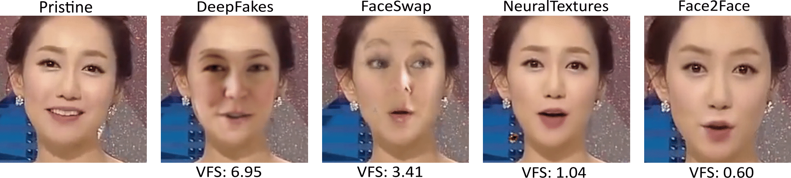

# Assessing the Visual Fidelity of Deepfake Videos: Video Fidelity Score (VFS) 

This repository provides a **reproducible** pipeline to compute the **Video Fidelity Score (VFS)** for a **single real** and a **single fake** video.  
The method extracts facial crops, computes **NR-IQA** metrics (BRISQUE + deep IQA models), and summarizes the **distributional difference** (effect size) between real vs fake to yield VFS.

> **Intuition:** Lower VFS means the fake video is **visually closer** to its pristine source (i.e., higher realism).  
> Our pipeline implements the three stages: pre-processing (face crops and resize), NR-IQA scoring, and effect-size based VFS.

---
## 📌 Overview

*Figure:* Illustration of the proposed method. The VFS score is calculated by measuring the distributional difference in NR-IQA scores between fake and source videos.

---

## 🚀 Quick Start

1. **Clone** this repo and prepare your environment (MATLAB + Python).  
2. **Place one real** and **one fake** video.  
3. **Run** the main.m .
   

*Figure:* Facial regions from a sample frame of a pristine video125 and its manipulated versions, with VFS scores computed via MANIQA.
