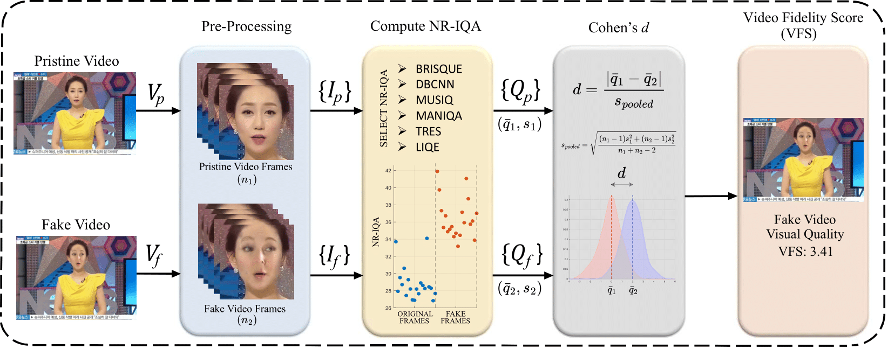
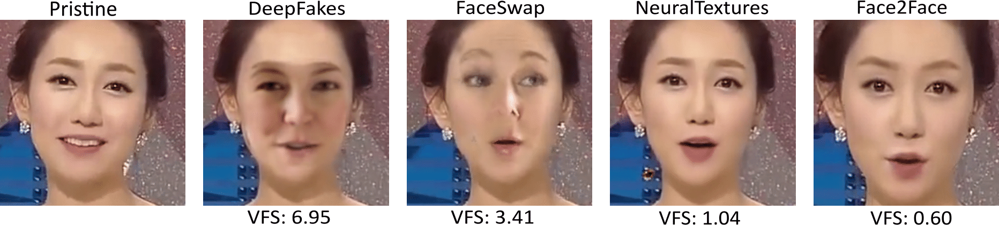

# Assessing the Visual Fidelity of Deepfake Videos: an NR-IQA-Based Approach -- Video Fidelity Score (VFS) 

This repository provides a **reproducible** pipeline to compute the **Video Fidelity Score (VFS)** for a **single real** and a **single fake** video.  
The method extracts facial crops, computes **NR-IQA** metrics (BRISQUE + deep IQA models), and summarizes the **distributional difference** (effect size) between real and fake to yield VFS.

> **Intuition:** Lower VFS values indicate higher **visual quality**, with VFS ≈ 0 suggesting the fake video exhibits no visible difference from the pristine video.


---


## 📌 Overview



*Figure 1:* Illustration of the proposed method. The VFS score is calculated by measuring the distributional difference in NR-IQA scores between fake and real videos.

The pipeline follows three major steps:
1. **Pre-processing** – Extract face crops from both videos using a dlib frontal face detector with padding and resize.  
2. **Quality Assessment** – Compute NR-IQA metrics: BRISQUE and deep models (LIQE, MANIQA, MUSIQ, DBCNN, TReS).  
3. **VFS Computation** – Compute standardized effect size (|Cohen’s d|) per metric to quantify perceptual similarity.


---


## 🧩 Dataset Information

The example real and fake videos used in this repository are derived from the **FaceForensics++** dataset.

> **Citation:**  
> Rössler, A., Cozzolino, D., Verdoliva, L., Riess, C., Thies, J., & Nießner, M. (2019).  
> *FaceForensics++: Learning to detect manipulated facial images.*  
> *Proceedings of the IEEE/CVF International Conference on Computer Vision (ICCV)*, 1-11.  
> [https://github.com/ondyari/FaceForensics](https://github.com/ondyari/FaceForensics)

All visual examples and cropped faces included here are used **only for research and educational purposes** in accordance with the dataset’s original license and terms of use.

> **3rd-party dataset DOI/URL:** [https://github.com/ondyari/FaceForensics](https://github.com/ondyari/FaceForensics)


---


## ⚙️ Requirements

To install the Python dependencies:

```bash
pip install -r requirements.txt
```

🛠 Computing Infrastructure

Experiments were tested on:
- Windows 10 (x64) and Ubuntu 24.04 LTS  
- MATLAB R2024a, Python 3.8 (Anaconda environment)
- **Hardware:** Intel i7 CPU or higher, 8 GB RAM minimum, optional NVIDIA GPU (e.g., RTX 1080 Ti)

**Software dependencies**

| Environment | Package / Toolbox | Version / Notes |
|--------------|------------------|-----------------|
| MATLAB | Image Processing Toolbox | R2024+ |
| MATLAB | Computer Vision Toolbox | — |
| Python | `python` | 3.8+ |
| Python | `dlib` | 19.24.6 |
| Python | `opencv-python` | 4.10.0+ |
| Python | `numpy` | 1.26+ |
| Python | (optional deep IQA libs) | e.g., `pyiqa`, `torch` |
| Git | (for reproducibility) | latest |


---


## 🚀 Quick Start

All codes in this repository are executed from a single MATLAB entry point (main.m).
The MATLAB script automatically calls the Python scripts for deep NR-IQA metrics, so users do not need to run Python separately.

Once the paths to the Python environment (`pythonPath`) and metric folder (`pyScriptsDir`) are correctly set, running `main.m` will automatically execute both MATLAB- and Python-based components, generate the corresponding metric scores, and produce the final VFS output files.

1. **Clone** this repo and prepare your environment (MATLAB + Python).  
2. **Place one real** and **one fake** video.  
3. **Run** the main.m .

### Example Usage (MATLAB)

```matlab
addpath('path/to/codes/folder');

realVideo = 'example_videos/real/video125.mp4';
fakeVideo = 'example_videos/fake/video125_038.mp4';
outDir    = 'results/';

pythonPath   = 'path/to/anaconda/envs/matlab_env/python';
pyScriptsDir = 'path/to/vfs/python/metrics';

metrics       = {'BRISQUE','LIQE','MANIQA','MUSIQ','DBCNN','TRES'};
functionTypes = {'matlab','python','python','python','python','python'};

pair_run(realVideo, fakeVideo, outDir, pythonPath, pyScriptsDir, metrics, functionTypes);
```
> The output folder will contain `real_iqm.csv`, `fake_iqm.csv`, and `vfs_summary.csv`.

> The provided demo pair (real and fake videos) is a subset of FaceForensics++ dataset.

⚠️ Note: The example data in `example_videos/` originates from FaceForensics++ and is subject to its dataset license.


---


## 🧑🏼‍🦲 Supplementary Figures and Experimental Materials

The following figure illustrates facial regions extracted from video ID 125 and its manipulated versions. It shows the VFS values computed specifically using the MANIQA metric for different manipulation methods.



*Figure 2:* Facial regions from a sample frame of a pristine video125 and its manipulated versions, with VFS values computed via MANIQA.


The following figure demonstrates facial regions extracted from sample frames of videos randomly selected from the *best* and *worst* groups for each deepfake dataset, determined using the DBCNN-based approach, along with their corresponding VFS values.  As shown in the figure, the proposed approach can clearly distinguish between high- and low-realism videos in each dataset,  with VFS values consistently aligning with human-perceived visual realism.


---


## 📚 License & Citation

**Code License:** MIT License  
**Dataset License:** FaceForensics++ dataset license (see link above)


