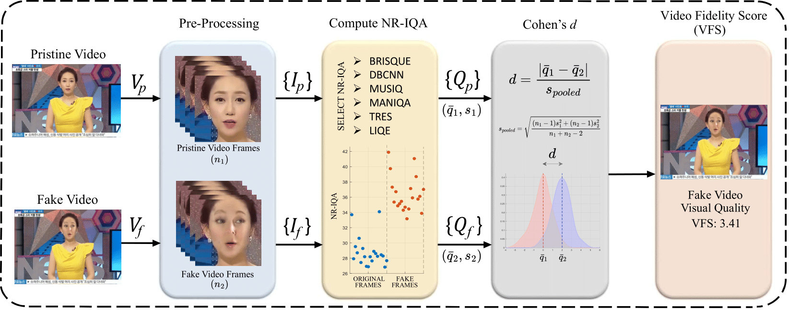

# Assessing the Visual Fidelity of Deepfake Videos: Video Fidelity Score (VFS) 

This repository provides a **reproducible** pipeline to compute the **Video Fidelity Score (VFS)** for a **single real** and a **single fake** video.  
The method extracts facial crops, computes **NR-IQA** metrics (BRISQUE + deep IQA models), and summarizes the **distributional difference** (effect size) between real and fake to yield VFS.

> **Intuition:** Lower VFS values indicate higher **visual quality**, with VFS≈0 suggesting the fake video exhibits no visible difference from the pristine video.

---
## 📌 Overview



*Figure 1:* Illustration of the proposed method. The VFS score is calculated by measuring the distributional difference in NR-IQA scores between fake and real videos.

The pipeline follows three major steps:
1. **Pre-processing** – Extract face crops from both videos using a dlib frontal face detector with padding and resize.  
2. **Quality Assessment** – Compute NR-IQA metrics: BRISQUE and deep models (LIQE, MANIQA, MUSIQ, DBCNN, TReS).  
3. **VFS Computation** – Compute standardized effect size (|Cohen’s d|) per metric to quantify perceptual similarity.

---

## 🧩 Dataset Information

The example real and fake videos used in this repository are derived from the **FaceForensics++** dataset.

> **Citation:**  
> Rössler, A., Cozzolino, D., Verdoliva, L., Riess, C., Thies, J., & Nießner, M. (2019).  
> *FaceForensics++: Learning to detect manipulated facial images.*  
> *Proceedings of the IEEE/CVF International Conference on Computer Vision (ICCV)*, 1-11.  
> [https://github.com/ondyari/FaceForensics](https://github.com/ondyari/FaceForensics)

All visual examples and cropped faces included here are used **only for research and educational purposes** in accordance with the dataset’s original license and terms of use.

> **3rd-party dataset DOI/URL:** [https://github.com/ondyari/FaceForensics](https://github.com/ondyari/FaceForensics)
---

## ⚙️ Requirements

🛠 Computing Infrastructure

Experiments were tested on:
- Windows 10 (x64) and Ubuntu 24.04 LTS  
- MATLAB R2024a, Python 3.8 (Anaconda environment)
- **Hardware:** NVIDIA RTX 1080 TI GPU (optional), 8 GB RAM minimum 

**Software dependencies**

| Environment | Package / Toolbox | Version / Notes |
|--------------|------------------|-----------------|
| MATLAB | Image Processing Toolbox | R2023+ |
| MATLAB | Computer Vision Toolbox | — |
| Python | `python` | 3.8+ |
| Python | `dlib` | 19.24.2 |
| Python | `opencv-python` | 4.9.0+ |
| Python | `numpy` | 1.26+ |
| Python | (optional deep IQA libs) | e.g., `pyiqa`, `torch` |
| Git | (for reproducibility) | latest |

---


## 🚀 Quick Start

1. **Clone** this repo and prepare your environment (MATLAB + Python).  
2. **Place one real** and **one fake** video.  
3. **Run** the main.m .

### Example Usage (MATLAB)
```matlab
addpath('path/to/codes/folder');

realVideo = 'example_videos/real/video125.mp4';
fakeVideo = 'example_videos/fake/video125_038.mp4';
outDir    = 'results/';

pythonPath   = 'path/to/anaconda/envs/matlab_env/python';
pyScriptsDir = 'path/to/vfs/python/metrics';

metrics       = {'BRISQUE','LIQE','MANIQA','MUSIQ','DBCNN','TRES'};
functionTypes = {'matlab','python','python','python','python','python'};

pair_run(realVideo, fakeVideo, outDir, pythonPath, pyScriptsDir, metrics, functionTypes);
```

The provided demo pair (real and fake videos) is a subset of FaceForensics++ dataset.
⚠️ Note: The example data in `example_videos/` originates from FaceForensics++ and is subject to its dataset license.


*Figure 2:* Facial regions from a sample frame of a real video125 and its manipulated versions, with VFS scores computed via MANIQA.


